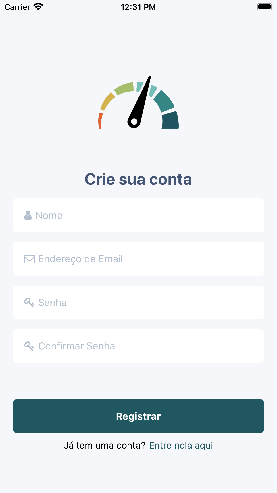
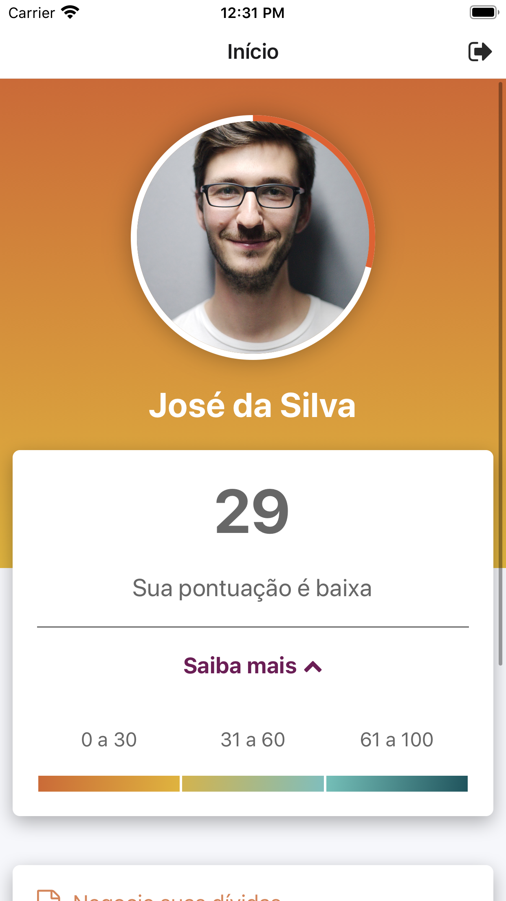
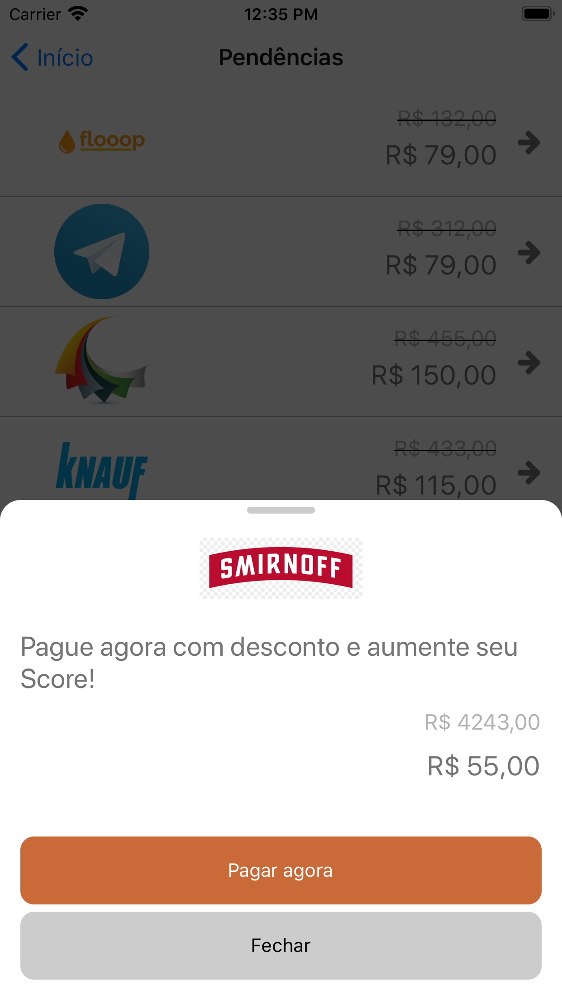
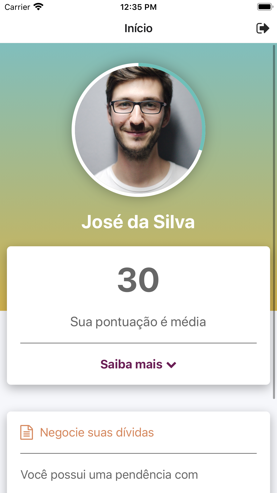

# Projeto ScoreRank

Este repositório contém o projeto de um aplicativo rank de Score

## Telas

## Mock

Para fazer funcionar a api de mock é preciso rodar o comando:

### yarn server

Tecnologias utilizadas:

 - ReactNative
 - TypeScript
 - StyledComponents
 - ReactRedux
 - JWT